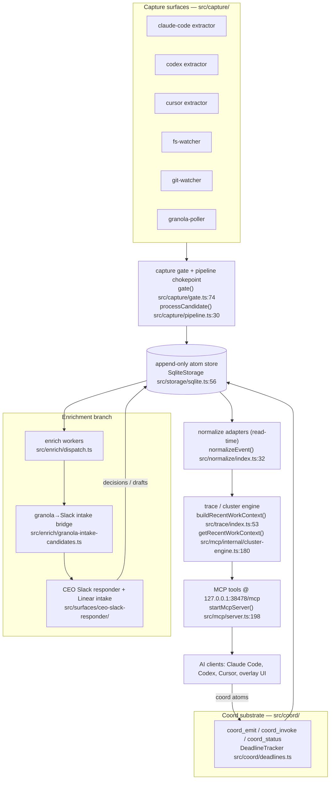

# ECHO architecture map

Generated **2026-07-03** from code at commit `0f77efa1`. This map is the strategist's entry point into the codebase when writing the next wave of specs and designs: 52 area pages, one per subsystem directory, each documenting every file's purpose, dependencies, and exported symbols.

**Grounding convention:** every symbol row on every area page cites its declaration as `path:line` (e.g. `src/mcp/server.ts:198`). A claim without a citation does not belong in this map. Line numbers are pinned to commit `0f77efa1`; treat them as approximate after subsequent merges and re-verify before quoting them in a spec.

**How to maintain this map:** the area pages are hand-verified reference documentation, not auto-generated output. When code in an area changes materially (new file, moved entry point, changed contract), edit that area's page in the same change wave and refresh its `> Covers N files` count and symbol rows. If a whole new `src/` or `tools/` subdirectory appears, add a new area page and a row to the directory table below.

## System overview

ECHO is the cross-platform context layer for AI-era knowledge work: a local daemon that passively captures the user's AI-tool activity — Claude Code and Codex JSONL transcripts, Cursor chat history, filesystem changes, git commit history, and Granola meeting notes — into a single append-only atom store, then serves that unified context back to every AI client over MCP. The brand promise is "we don't make AI smarter, we make every AI smarter about you"; architecturally that means one capture substrate, one storage contract, and one retrieval surface shared by all tools.

The write side is the capture layer (`src/capture/`). Extractors (`src/capture/extractors/claude-code.ts`, `codex.ts`, `cursor.ts`) and surfaces (`src/capture/surfaces/fs-watcher.ts`, `git-watcher.ts`, `granola-poller.ts`) produce `CaptureEvent` candidates, all of which flow through a single chokepoint: `processCandidate` (`src/capture/pipeline.ts:30`) runs the allowlist gate (`gate`, `src/capture/gate.ts:74`), canonicalizes timestamps, and appends the event to storage. Storage is the `Storage` contract (`src/storage/interface.ts`) with two implementations — `SqliteStorage` (`src/storage/sqlite.ts:56`, WAL-mode better-sqlite3) in production and `MemoryStorage` for tests. Atoms are append-only: no upsert, no in-place modify.

The read side normalizes at query time. Per-source adapters (`src/normalize/adapters/`) convert raw `CaptureEvent`s into `NormalizedContextEvent`s via `normalizeEvent` (`src/normalize/index.ts:32`); the trace engine builds an artifact-sharing graph, clusters it into connected components, and ranks/labels the clusters (`buildRecentWorkContext`, `src/trace/index.ts:53`); the cluster engine wraps that with windowing, auto-expand, and wire-shape caps (`getRecentWorkContext`, `src/mcp/internal/cluster-engine.ts:180`). All of it is served by the MCP HTTP daemon (`startMcpServer`, `src/mcp/server.ts:198`) at `http://127.0.0.1:38478/mcp` (default port resolved by `resolveMcpPort`, `src/daemon/index.ts:25`), exposing tools like `find_clusters`, `search_memories`, `get_atom(s)`, `wait_for_new_turns`, and the coord and task-state tool families.

Around the product core sit three more systems. The `echoctl` CLI (`main`, `src/cli/index.ts:98`; published as the `echoctl` npm bin) handles onboarding, daemon lifecycle, doctor, selftest, and workflow dispatch, with `src/echo-home/` managing `~/.echo` and per-vendor config wiring (Claude Code, Codex, Cursor). The coord substrate (`src/coord/` plus the `coord_*` MCP tools) is the typed event ledger that lets multiple AI agents coordinate through ECHO itself. And the enrichment/surfaces branch (`src/enrich/`, `src/brain/`, `src/surfaces/ceo-slack-responder/`) drives the org-alignment loop: Granola signal extraction feeds a Slack intake bridge and a CEO-facing Slack responder with Linear issue creation. Finally, `tools/review-queue/` and `tools/backlog/` are not product code — they are the multi-agent development infrastructure (reviewer ticks, builder wrappers, backlog state machine) that this repo uses to build ECHO with ECHO.

## Data flow

Two flow details worth keeping in mind when speccing: normalization happens at read time (raw `CaptureEvent`s are what's persisted; `NormalizedContextEvent`s are derived per query), and every write — including coord atoms and team decisions — lands in the same append-only store, distinguished by `source` prefix.

## Area directory

All 52 area pages, grouped by tree. "Files" is each page's `Covers N files` count.

### Product source (`src/`)

| Page | Files | Description |
|---|---|---|
| [src-capture.md](src-capture.md) | 13 | Capture layer: JSONL extractors for Claude Code/Codex, Cursor SQLite extractor, fs/git watchers, Granola poller, allowlist gate, pipeline chokepoint, source config, workspace-root canonicalization. |
| [src-normalize.md](src-normalize.md) | 11 | Read-time normalization: per-source adapters (claude-code, codex, cursor, git, granola), artifact-id construction, adapter dispatch registry, the `NormalizedContextEvent` schema. |
| [src-storage.md](src-storage.md) | 5 | The `Storage`/`CaptureEvent`/`QueryFilter` contract plus SQLite and in-memory backends, SQL migrations, and source-match query predicates. |
| [src-trace.md](src-trace.md) | 8 | Trace engine: artifact-sharing graph builder and connected-component clustering, ranking signals, heuristic labels, open-loop hints, single-source-recent auto-expand predicate. |
| [src-mcp.md](src-mcp.md) | 32 | MCP HTTP daemon: server bootstrap + tool registration, all retrieval/coord/task-state/decision tool implementations, the cluster-discovery engine, wire-shape caps/projectors, shared validation utils, request ring log. |
| [src-daemon.md](src-daemon.md) | 2 | Daemon process entrypoint (boots storage, all capture surfaces, enrichment, MCP server) and lifecycle management (data-dir resolution, PID lock, orchestrated shutdown). |
| [src-cli.md](src-cli.md) | 18 | `echoctl` CLI: command router; daemon/doctor/init/orchestration/project/run/selftest/uninstall commands; inverse (uninstall) config editors; prompt/render IO; workflow TOML dispatch engine. |
| [src-echo-home.md](src-echo-home.md) | 22 | `~/.echo` management: `syncAll()` adapter-sync orchestrator, per-vendor MCP/config adapters (Claude Code, Codex, Cursor), roles/skills/workflows sync, scaffolding, and the onboarding wizard (agent/project detection, probing, wiring). |
| [src-coord.md](src-coord.md) | 8 | Coord substrate internals: event type registry with tier policy, per-tier input validation, role identity resolution, `coord-roles.json` loader, deadline tracker with boot-time ledger replay, daemon-internal emitter. |
| [src-enrich.md](src-enrich.md) | 4 | Enrichment workers: fan-out dispatch, Granola meeting-signal extraction, the Granola→Slack intake seed bridge, and the durable at-least-once seed state machine. |
| [src-brain.md](src-brain.md) | 2 | CEO-loop "brain": runs codex/claude CLI as a scoped subprocess to answer questions from ECHO context; deterministic Slack intake-reply parsing; intake seed-marker codec. |
| [src-surfaces.md](src-surfaces.md) | 12 | CEO Slack responder surface: Socket Mode responder, append-only team-decision store, draft/intake-draft stores with exactly-once create, Linear GraphQL client, issue templating, `propose_decision` MCP tool. |
| [src-reasoning.md](src-reasoning.md) | 1 | Pure on-demand derivation of causal/relational edges (tool-touch chains, git state transitions, cross-tool task clusters) over `CaptureEvent` sequences — no persisted graph. |
| [src-logging.md](src-logging.md) | 1 | Dependency-free structured JSON-line logger with `ECHO_LOG_LEVEL` severity filtering. |
| [src-util.md](src-util.md) | 3 | Small shared helpers: BOM-safe JSON parsing, cross-platform subprocess command resolution, timestamp canonicalization for lexicographic comparison. |
| [src.md](src.md) | 2 | Top-level `src/` stragglers: a non-empty-string type guard (`guards.ts`) and the empty `index.ts` placeholder. |

### Dev tooling (`tools/`)

| Page | Files | Description |
|---|---|---|
| [tools.md](tools.md) | 16 | Repo-level tooling: `backlog_index.py` / `wiki_index.py` generators, `blocked.py`, trace viewers (`render-trace.ts`, `serve-trace.ts`, `stream-watch.ts` + shared renderer), `sync-skills.sh`, pre-commit hook installer, MCP/foreign-install smoke scripts. |
| [tools-review-queue.md](tools-review-queue.md) | 38 | The cross-tool review-queue machinery: `request.py`/`combine.py`/`promote.py`/`dispatch-next-round.py`, reviewer wrapper shells (`run-codex-reviewer.sh` etc.) with clean-snapshot worktrees, launchd installers, sidecar/YAML validators, and their self-test scripts. |
| [tools-backlog.md](tools-backlog.md) | 1 | `run-codex-builder.sh`: lock-guarded wrapper that lets Codex claim and execute the next ready backlog item as a builder binding. |
| [tools-task-state.md](tools-task-state.md) | 3 | Role-typed task-state pointer tooling: schema lint (`lint.py`), builder-state patcher, round-state push script. |
| [tools-dogfooding.md](tools-dogfooding.md) | 1 | `journal-cat.sh`: the canonical reader that merges per-actor dogfooding-journal shards into one chronological stream. |
| [tools-echo-overlay.md](tools-echo-overlay.md) | 22 | The overlay UI (React/Vite app under `tools/echo-overlay/`): MCP polling, fleet/decision views, bridge/model layers, plus its own vitest suite and configs. |
| [tools-retrieval-eval.md](tools-retrieval-eval.md) | 2 | Retrieval-eval harness CLI: fixture builder and case/fixture validator-runner. |

### Tests (`tests/`)

| Page | Files | Description |
|---|---|---|
| [tests-capture.md](tests-capture.md) | 12 | Suites for `src/capture/`: extractors, gate, pipeline, sources, fs/git watchers, Granola poller, workspace-root and origin-URL scrubbing. |
| [tests-normalize.md](tests-normalize.md) | 14 | Suites + fixtures for `src/normalize/`: per-adapter tests, artifact identity, dispatch, repo/workspace-identity convergence, JSON round-trip. |
| [tests-storage.md](tests-storage.md) | 7 | Suites for `src/storage/`: SQLite durability/migration, memory backend, and backend-parity conformance (getByIds, metadata_match, source-match, coord append-order iteration). |
| [tests-trace.md](tests-trace.md) | 9 | Suites + atom fixtures for `src/trace/`: clustering, ranking, labels, hints, auto-expand, cross-adapter repo identity. |
| [tests-mcp.md](tests-mcp.md) | 21 | Suites for `src/mcp/`: server/transport, each retrieval tool, wire-shape projectors, request log, audit endpoint, envelope byte-budget chain. |
| [tests-echo-mcp.md](tests-echo-mcp.md) | 1 | Role-state/task-state MCP tool suite (046 AC4): ref-pinning, byte-identity vs `git show`, HEAD-race safety against git fixtures. |
| [tests-coord.md](tests-coord.md) | 23 | Suites for the coord substrate: emit/invoke validation, deadline reconstruction and single-fire, identity spoof rejection, idempotency, non-pollution of retrieval tools, wrapper transport. |
| [tests-daemon.md](tests-daemon.md) | 3 | Daemon boot/shutdown/PID-lock integration (quarantined), shutdown flush, Granola intake-bridge scheduling. |
| [tests-cli.md](tests-cli.md) | 16 | Suites for `src/cli/`: every echoctl subcommand, inverse config removal, prompt IO, workflow dispatch/load/match, packaged-binary smoke test. |
| [tests-echo-home.md](tests-echo-home.md) | 19 | Suites for `src/echo-home/`: adapter-sync orchestration, each vendor adapter, roles/scaffold/paths, and the full wizard submodule set. |
| [tests-enrich.md](tests-enrich.md) | 3 | Suites for `src/enrich/`: Granola signals worker, intake candidate bridge, durable seed-claim store. |
| [tests-surfaces.md](tests-surfaces.md) | 14 | Suites for the CEO Slack responder: brain regressions, propose/confirm idempotency, intake gate/follow-up, Linear client, issue provenance, socket lifecycle. |
| [tests-reasoning.md](tests-reasoning.md) | 1 | Unit tests for the causal reasoning derivation module. |
| [tests-logging.md](tests-logging.md) | 1 | Unit tests for the JSON-line logger. |
| [tests-util.md](tests-util.md) | 2 | Unit tests for the JSON and subprocess utils. |
| [tests-review-queue.md](tests-review-queue.md) | 26 | Orchestration-infra suites for `tools/review-queue/`: combine/request/promote state machines, concurrency invariants, reviewer read-only and fresh-eyes enforcement, N-reviewer roster framework, e2e cycle. |
| [tests-backlog.md](tests-backlog.md) | 4 | Suites for backlog tooling: `backlog_index.py` rendering, process-backlog skill hooks, `run-codex-builder.sh` wrapper contract. |
| [tests-task-state.md](tests-task-state.md) | 4 | Suites for task-state pointer tooling: anchor parsing, lint, builder-state patch, round-state push. |
| [tests-skills.md](tests-skills.md) | 2 | Substrate-neutral P1 atomic-state-transition harness (proved against the process-backlog skill's publish/recovery transcript) and merge-and-cleanup shape tests. |
| [tests-dogfooding.md](tests-dogfooding.md) | 1 | Tests for `journal-cat.sh` merging and the reviewer wrapper's actor-scoped journal writes. |
| [tests-sync-skills.md](tests-sync-skills.md) | 1 | Tests for `install-echo-codex-skills.sh` (canonical skills → `~/.codex/skills` rendering). |
| [tests-tools.md](tests-tools.md) | 1 | Tests for the pre-commit hook installer. |
| [tests-packaging.md](tests-packaging.md) | 2 | npm-pack guards: dist import-closure resolution and packed-manifest snapshot. |
| [tests-retrieval-eval.md](tests-retrieval-eval.md) | 5 | Suites for the retrieval-eval harness: case schema, determinism, runner, scorer, seed-case invariants. |
| [tests-fixtures.md](tests-fixtures.md) | 4 | Shared test fixtures: allowlist reset, Cursor globalStorage SQLite builder, JSONL/temp-dir helpers, stdout capture. |
| [tests.md](tests.md) | 2 | Top-level smoke test (CI wiring check) and Windows-compat test. |

### Repo root and eval

| Page | Files | Description |
|---|---|---|
| [root.md](root.md) | 4 | Repo-root configs: ESLint flat config and the three Vitest configs (default, product, orchestration). |
| [scripts.md](scripts.md) | 3 | Build/deploy scripts: SQL-migration copier into `dist/`, launchd daemon install/uninstall. |
| [eval.md](eval.md) | 2 | Evaluation harnesses: Cold Reader Test arm runner (`eval/cold-reader/run.sh`) and retrieval-eval case schema (`eval/retrieval/schema.ts`). |

## Runtime processes & entry points

- **Daemon** — `src/daemon/index.ts` is a top-level executable module: it resolves the MCP port (`resolveMcpPort`, `src/daemon/index.ts:25`, default 38478 via `ECHO_MCP_PORT`), chooses the storage backend (`createStorage`, `src/daemon/index.ts:33`), concurrently starts the fs/git watchers, Granola poller, enrichment dispatch, three extractors, and the MCP server (`src/daemon/index.ts:72`), wires the Granola→Slack intake bridge (`src/daemon/index.ts:96`), and hands off to `startLifecycle` (`src/daemon/lifecycle.ts:136`) for PID locking and orchestrated shutdown (`src/daemon/index.ts:100`). Run via `npm run daemon` in dev; in production it is the `com.echo.daemon` launchd job.
- **echoctl CLI** — `main(argv)` at `src/cli/index.ts:98` is the dispatcher behind the published `echoctl` bin (`package.json` `bin` → `./dist/cli/index.js`). Subcommands: `init` (onboarding wizard), `daemon` (launchd lifecycle, `src/cli/commands/daemon.ts`), `doctor`, `selftest`, `project`, `orchestration init`, `run <workflow>`, `uninstall`.
- **MCP server** — `startMcpServer(storage, options?)` at `src/mcp/server.ts:198`: raw `http.Server` that creates a fresh `McpServer` + transport per POST, derives caller identity from the `X-Echo-Role` header, registers all tools, and hard-gates startup on valid coord-roles config and deadline-tracker reconstruction. Serves `http://127.0.0.1:38478/mcp` in production.
- **CEO Slack responder** — `src/surfaces/ceo-slack-responder/index.ts:8` has a module-run guard that calls `runSlackResponder(loadResponderConfig())` when executed as a process entry point. It is a separate long-running Slack Socket Mode process, talks to the daemon's MCP endpoint (`DEFAULT_ECHO_MCP_URL = 'http://127.0.0.1:38478/mcp'`, `src/surfaces/ceo-slack-responder/responder.ts:65`), and is explicitly excluded from the packaged npm dist (`!dist/surfaces/ceo-slack-responder/**` in `package.json` `files`).
- **echo-overlay UI** — a separate Vite/React app under `tools/echo-overlay/` (entry `tools/echo-overlay/src/main.tsx`) that polls the MCP server for fleet/decision views; it has its own eslint/vite/vitest configs and test suite.
- **launchd scripts** — `scripts/launchd/install.sh` / `uninstall.sh` install and remove the daemon LaunchAgent from a dev checkout (`npm run daemon:install`); the packaged path is `echoctl daemon install`, which renders and lints its own plist (`src/cli/commands/daemon.ts`).
- **Trace viewers** — `tools/serve-trace.ts` (live HTTP+SSE viewer), `tools/render-trace.ts` (snapshot), and `tools/stream-watch.ts` (terminal stream), all sharing `tools/_trace_render.ts`; run via `npm run serve:trace` etc.

## Non-code repo areas

- **`backlog/`** — the build coordination state machine: items flow `proposed/ → ready/ → claimed/ → pending_review/ → complete/` (plus `archive/`), with `reviews/` holding per-round cross-tool review-queue requests/responses and `task-state/` holding role-typed working-memory pointers. `docs/BACKLOG.md` is generated from this folder state by `tools/backlog_index.py`; never hand-edit it.
- **`skills/`** — the canonical, vendor-neutral cross-tool collaboration protocol (process-backlog, review-queue-* ticks, merge-and-cleanup, role-typed-task-state, etc.). `.claude/commands/` copies are derived by `tools/sync-skills.sh`; edit only the canonical `skills/<name>.md`.
- **`wiki/`** — lagging documentation of shipped reality, organized into eight folders (product, principles, architecture, capture, capture/per-app, surfaces, research, operating-model). Pages are written only after an item lands in `backlog/complete/`; `wiki/index.md` is regenerated by `tools/wiki_index.py`.
- **`raw/`** — unstructured working material: `raw/internal/` holds decisions, agent-run logs, the cross-tool dogfooding journal shards, interviews, and handoffs; `raw/external/` holds precedent research and competitor scans.
- **`docs/`** — operating documentation: `AGENT_INSTRUCTIONS.md`, the generated `BACKLOG.md`, install/onboarding guides (`echoctl-install.md`, `SEND-TO-TESTER.md`), MCP-integration and review-queue setup docs, and this architecture map.
- **`eval/`** — evaluation harnesses and their committed cases: `eval/cold-reader/` (the Cold Reader Test arms and results) and `eval/retrieval/` (retrieval-eval case schema and fixtures).
- **`assets/`** — shipped runtime assets packaged with echoctl: `echo-skills/`, `echo-roles/`, and `echo-workflows/` are the defaults that `src/echo-home/` syncs into `~/.echo` and each vendor's home directory.

## Test topology

Three Vitest configs implement the product-vs-orchestration CI split (item 092 lineage):

- **`vitest.config.ts`** — default/full run: `tests/**/*.test.ts` with no exclusions (`npm test`).
- **`vitest.product.config.ts`** — the product CI gate: the full tree minus an explicit orchestration exclusion list (`npm run test:product`).
- **`vitest.orchestration.config.ts`** — only the orchestration/dev-infra subset (`npm run test:orchestration`): `tests/review-queue/**/*.test.ts`, `tests/backlog/backlog-index.test.ts`, `tests/backlog/process-backlog-skill.test.ts`, `tests/coord/no-pre-push-spawn.test.ts`, `tests/skills/atomic-state-transition-harness.test.ts`, `tests/task-state/lint.test.ts`, and `tests/task-state/patch-builder-state.test.ts`. The product config excludes exactly this same list, so the two configs partition the tree.

Test areas map onto source areas almost one-to-one: `tests/capture` → `src/capture`, `tests/normalize` → `src/normalize`, `tests/storage` → `src/storage`, `tests/trace` → `src/trace`, `tests/mcp` + `tests/echo-mcp` → `src/mcp`, `tests/coord` → `src/coord` (and the coord MCP tools), `tests/daemon` → `src/daemon`, `tests/cli` → `src/cli`, `tests/echo-home` → `src/echo-home`, `tests/enrich` → `src/enrich`, `tests/surfaces` → `src/surfaces` + `src/brain`, `tests/reasoning` → `src/reasoning`, `tests/logging` → `src/logging`, `tests/util` → `src/util`. The remainder target tooling rather than `src/`: `tests/review-queue` → `tools/review-queue`, `tests/backlog` → `tools/backlog` + `tools/backlog_index.py`, `tests/task-state` → `tools/task-state`, `tests/dogfooding` → `tools/dogfooding`, `tests/sync-skills` + `tests/tools` → `tools/` scripts, `tests/retrieval-eval` → `tools/retrieval-eval` + `eval/retrieval`, `tests/skills` → the `skills/` protocol transcripts, and `tests/packaging` → the npm pack manifest itself. `tests/fixtures` is shared helpers; `tests/smoke.test.ts` and `tests/windows-compat.test.ts` are runner-level checks. Note that `tests/daemon/lifecycle.test.ts` is quarantined (see [tests-daemon.md](tests-daemon.md)); the overlay's tests live inside `tools/echo-overlay/test/` with their own vitest config, outside all three root configs.
