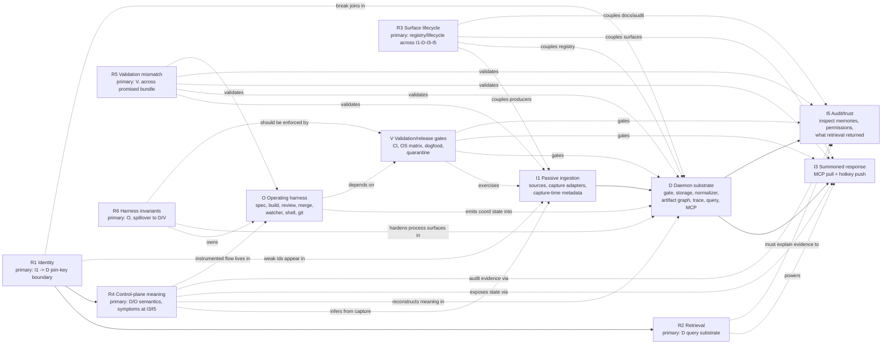

# Follow-up Root Causes by Layer

Source: `backlog/_followups.md` as of 2026-06-07, mapped against `wiki/architecture/interface-layers.md` and `wiki/architecture/system-architecture.md`.

This is a visualization aid, not a new backlog spec. It answers: where does each root cause primarily happen, and where do its symptoms show up?

## Layer Key

The product interface layers are not enough by themselves, because several follow-up roots happen inside the daemon substrate or outside the product in the multi-agent operating harness.

| Key | Layer | Meaning here |
|---|---|---|
| I1 | Interface L1: passive ingestion | App/file/git sources, capture adapters, source metadata, capture-time identifiers |
| D | Daemon substrate | Capture gate, storage, normalizer, artifact graph, trace layer, query/index/ranking, MCP registry |
| I3 | Interface L3: summoned response | MCP pull, hotkey push, AI-client retrieval surfaces |
| I5 | Interface L5: audit/trust | Inspector, permissions, returned-evidence/audit visibility |
| V | Validation and release gates | CI, platform matrix, dogfooding gates, coverage/quarantine |
| O | Operating harness | Backlog, spec review, builder/reviewer/watcher/merge flows, shell/process contracts |

No current root is primarily "I2 ambient surfacing" or "I4 conversational dialogue"; both stay deferred. Do not read this map as permission to build those layers.

## Layer Map

## Heatmap

Legend: `P` = primary failure layer, `S` = symptom or spillover layer, `U` = upstream prerequisite.

| Root | I1 passive ingestion | D daemon substrate | I3 summoned response | I5 audit/trust | V validation/release | O operating harness |
|---|---:|---:|---:|---:|---:|---:|
| R1 - Canonical work-artifact identity is not first-class | P | P | S | S | S |  |
| R2 - Retrieval is raw-scan/storage-shaped | U | P | S | S | S |  |
| R3 - Surface lifecycle is not registry-coupled | S | P | P | P | S | S |
| R4 - Control-plane meaning exists only on instrumented paths | U | P | S | S |  | P |
| R5 - Validation coverage and gates mismatch bundle/platform | S | S | S | S | P | S |
| R6 - Multi-agent harness invariants are not code-owned contracts |  | S |  |  | S | P |

## Root-by-Root Read

| Root | Primary layer | Why that layer is primary | Main spillovers |
|---|---|---|---|
| R1 | I1 -> D join-key boundary | Capture adapters assign inconsistent IDs before storage/normalization can build a reliable artifact graph. | Retrieval quality (R2), passive control inference (R4), audit/debug opacity. |
| R2 | D query substrate | Search, pagination, indexing, ranking, clipping, source filters, and diagnostics live in the storage/query/trace/MCP read path. | I3 consumers see bad recall; I5 cannot explain exactly what was returned. |
| R3 | Registry/lifecycle across D plus surfaces | The broken contract is that registered, documented, produced, and dogfooded drift independently. This is a lifecycle boundary, not one UI or adapter. | L1 producer gaps, MCP roster drift, stale docs/wiki/audit, deprecated surfaces lingering. |
| R4 | D/O semantic control plane | Structured flows emit coord events, but improvised work is not reconstructed into ownership/deadline/closure state. | Needs R1 IDs, appears in I3 status/tools and I5 evidence, depends on O harness semantics. |
| R5 | V validation/release gates | The root is not that one feature is wrong; it is that promised bundle/platform surfaces are not continuously exercised. | Cursor/fs-watcher/browser/Windows gaps survive into I1, D, I3, I5, and O. |
| R6 | O operating harness | The build/review/merge machine trusts ambient git state, shell behavior, local truth, stale adapters, and human convention. | Produces daemon coord semantics, needs CI gates, blocks the founder-out-of-loop condition. |

## Size Signal From Current Follow-up Snapshot

These counts are bullet rows under each root before the Archive section. Composite bullets can represent multiple incidents, so treat this as relative weight rather than exact incident count.

| Root | Rows | Open | Partial | Deferred |
|---|---:|---:|---:|---:|
| R1 | 10 | 8 | 2 | 0 |
| R2 | 29 | 25 | 4 | 0 |
| R3 | 16 | 15 | 1 | 0 |
| R4 | 13 | 13 | 0 | 0 |
| R5 | 41 | 31 | 9 | 1 |
| R6 | 64 | 53 | 10 | 0 |

## Fix-Order Overlay

1. R1 first for the context layer: without stable artifact IDs, R2 retrieval and R4 passive inference are bounded.
2. R6 co-equal for founder-out-of-loop: process/harness failures are what force human intervention even when context-layer work improves.
3. R2 after R1: add real query substrate improvements once joins are reliable.
4. R4 after or alongside R1/R6: reconstruct improvised control-plane meaning using stable IDs and code-owned harness state.
5. R3 as a coupling/gate pass: make registered, documented, produced, and dogfooded one lifecycle contract.
6. R5 as continuous exercise: turn under-dogfooded surfaces and platforms into daily/CI gates, not after-the-fact audits.
