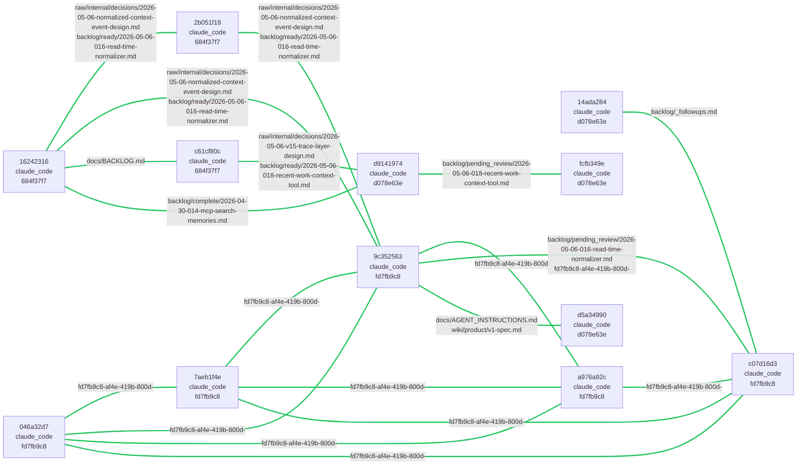

# Trace response — edge graph (cluster 1 of `get_recent_work_context`)

**Source data:** `./full-response.json` (one real call, captured 2026-05-07)

## The dataset

- Cluster 1 = "discussion about Project_echo"
- 36 atoms total, **630 edges** (= K₃₆, every pair connected)
- This subgraph: **12 atoms** (the ones involved in at least one *essential* edge)
- Within those 12 atoms: 66 possible pairs; **19** carry signal beyond cluster anchors
- Across the FULL cluster: 611 / 630 edges (97.0%) are redundant; 19 / 630 (3.0%) essential
- Bytes: full edge list = **161,161**, essential-only = **7,009** (= **4.3%** of current bloat)

## Color key

- 🟢 **Green (thick)** — *essential* edge: pair shares a non-anchor artifact (a specific file or sub-session). This is information that cluster membership alone does not give you.
- 🔴 **Red (thin, faded)** — *redundant* edge: pair only shares cluster anchor artifacts (the conversation + the repo). All atoms share these by definition; the edge restates cluster membership.

## Current shape — every pairwise edge drawn (what the MCP returns today)

```mermaid
flowchart LR
  046a32d7["046a32d7\nclaude_code\nfd7fb9c8"]
  14ada284["14ada284\nclaude_code\nd078e63e"]
  16242316["16242316\nclaude_code\n684f37f7"]
  2b051f18["2b051f18\nclaude_code\n684f37f7"]
  7aeb1f4e["7aeb1f4e\nclaude_code\nfd7fb9c8"]
  9c352563["9c352563\nclaude_code\nfd7fb9c8"]
  a976a92c["a976a92c\nclaude_code\nfd7fb9c8"]
  c07d16d3["c07d16d3\nclaude_code\nfd7fb9c8"]
  c61cf80c["c61cf80c\nclaude_code\n684f37f7"]
  d5a34990["d5a34990\nclaude_code\nd078e63e"]
  d9141974["d9141974\nclaude_code\nd078e63e"]
  fcfb349e["fcfb349e\nclaude_code\nd078e63e"]

  046a32d7 --- 14ada284
  046a32d7 --- 16242316
  046a32d7 --- 2b051f18
  046a32d7 -- "fd7fb9c8-af4e-419b-800d-" --- 7aeb1f4e
  046a32d7 -- "fd7fb9c8-af4e-419b-800d-" --- 9c352563
  046a32d7 -- "fd7fb9c8-af4e-419b-800d-" --- a976a92c
  046a32d7 -- "fd7fb9c8-af4e-419b-800d-" --- c07d16d3
  046a32d7 --- c61cf80c
  046a32d7 --- d5a34990
  046a32d7 --- d9141974
  046a32d7 --- fcfb349e
  14ada284 --- 16242316
  14ada284 --- 2b051f18
  14ada284 --- 7aeb1f4e
  14ada284 --- 9c352563
  14ada284 --- a976a92c
  14ada284 -- "backlog/_followups.md" --- c07d16d3
  14ada284 --- c61cf80c
  14ada284 --- d5a34990
  14ada284 --- d9141974
  14ada284 --- fcfb349e
  16242316 -- "raw/internal/decisions/2026-05-06-normalized-context-event-design.md<br>backlog/ready/2026-05-06-016-read-time-normalizer.md" --- 2b051f18
  16242316 --- 7aeb1f4e
  16242316 -- "raw/internal/decisions/2026-05-06-normalized-context-event-design.md<br>backlog/ready/2026-05-06-016-read-time-normalizer.md" --- 9c352563
  16242316 --- a976a92c
  16242316 --- c07d16d3
  16242316 -- "docs/BACKLOG.md" --- c61cf80c
  16242316 --- d5a34990
  16242316 -- "backlog/complete/2026-04-30-014-mcp-search-memories.md" --- d9141974
  16242316 --- fcfb349e
  2b051f18 --- 7aeb1f4e
  2b051f18 -- "raw/internal/decisions/2026-05-06-normalized-context-event-design.md<br>backlog/ready/2026-05-06-016-read-time-normalizer.md" --- 9c352563
  2b051f18 --- a976a92c
  2b051f18 --- c07d16d3
  2b051f18 --- c61cf80c
  2b051f18 --- d5a34990
  2b051f18 --- d9141974
  2b051f18 --- fcfb349e
  7aeb1f4e -- "fd7fb9c8-af4e-419b-800d-" --- 9c352563
  7aeb1f4e -- "fd7fb9c8-af4e-419b-800d-" --- a976a92c
  7aeb1f4e -- "fd7fb9c8-af4e-419b-800d-" --- c07d16d3
  7aeb1f4e --- c61cf80c
  7aeb1f4e --- d5a34990
  7aeb1f4e --- d9141974
  7aeb1f4e --- fcfb349e
  9c352563 -- "fd7fb9c8-af4e-419b-800d-" --- a976a92c
  9c352563 -- "backlog/pending_review/2026-05-06-016-read-time-normalizer.md<br>fd7fb9c8-af4e-419b-800d-" --- c07d16d3
  9c352563 --- c61cf80c
  9c352563 -- "docs/AGENT_INSTRUCTIONS.md<br>wiki/product/v1-spec.md" --- d5a34990
  9c352563 --- d9141974
  9c352563 --- fcfb349e
  a976a92c -- "fd7fb9c8-af4e-419b-800d-" --- c07d16d3
  a976a92c --- c61cf80c
  a976a92c --- d5a34990
  a976a92c --- d9141974
  a976a92c --- fcfb349e
  c07d16d3 --- c61cf80c
  c07d16d3 --- d5a34990
  c07d16d3 --- d9141974
  c07d16d3 --- fcfb349e
  c61cf80c --- d5a34990
  c61cf80c -- "raw/internal/decisions/2026-05-06-v15-trace-layer-design.md<br>backlog/ready/2026-05-06-018-recent-work-context-tool.md" --- d9141974
  c61cf80c --- fcfb349e
  d5a34990 --- d9141974
  d5a34990 --- fcfb349e
  d9141974 -- "backlog/pending_review/2026-05-06-018-recent-work-context-tool.md" --- fcfb349e

  linkStyle 0 stroke:#ef4444,stroke-width:1px,opacity:0.4
  linkStyle 1 stroke:#ef4444,stroke-width:1px,opacity:0.4
  linkStyle 2 stroke:#ef4444,stroke-width:1px,opacity:0.4
  linkStyle 3 stroke:#22c55e,stroke-width:3px
  linkStyle 4 stroke:#22c55e,stroke-width:3px
  linkStyle 5 stroke:#22c55e,stroke-width:3px
  linkStyle 6 stroke:#22c55e,stroke-width:3px
  linkStyle 7 stroke:#ef4444,stroke-width:1px,opacity:0.4
  linkStyle 8 stroke:#ef4444,stroke-width:1px,opacity:0.4
  linkStyle 9 stroke:#ef4444,stroke-width:1px,opacity:0.4
  linkStyle 10 stroke:#ef4444,stroke-width:1px,opacity:0.4
  linkStyle 11 stroke:#ef4444,stroke-width:1px,opacity:0.4
  linkStyle 12 stroke:#ef4444,stroke-width:1px,opacity:0.4
  linkStyle 13 stroke:#ef4444,stroke-width:1px,opacity:0.4
  linkStyle 14 stroke:#ef4444,stroke-width:1px,opacity:0.4
  linkStyle 15 stroke:#ef4444,stroke-width:1px,opacity:0.4
  linkStyle 16 stroke:#22c55e,stroke-width:3px
  linkStyle 17 stroke:#ef4444,stroke-width:1px,opacity:0.4
  linkStyle 18 stroke:#ef4444,stroke-width:1px,opacity:0.4
  linkStyle 19 stroke:#ef4444,stroke-width:1px,opacity:0.4
  linkStyle 20 stroke:#ef4444,stroke-width:1px,opacity:0.4
  linkStyle 21 stroke:#22c55e,stroke-width:3px
  linkStyle 22 stroke:#ef4444,stroke-width:1px,opacity:0.4
  linkStyle 23 stroke:#22c55e,stroke-width:3px
  linkStyle 24 stroke:#ef4444,stroke-width:1px,opacity:0.4
  linkStyle 25 stroke:#ef4444,stroke-width:1px,opacity:0.4
  linkStyle 26 stroke:#22c55e,stroke-width:3px
  linkStyle 27 stroke:#ef4444,stroke-width:1px,opacity:0.4
  linkStyle 28 stroke:#22c55e,stroke-width:3px
  linkStyle 29 stroke:#ef4444,stroke-width:1px,opacity:0.4
  linkStyle 30 stroke:#ef4444,stroke-width:1px,opacity:0.4
  linkStyle 31 stroke:#22c55e,stroke-width:3px
  linkStyle 32 stroke:#ef4444,stroke-width:1px,opacity:0.4
  linkStyle 33 stroke:#ef4444,stroke-width:1px,opacity:0.4
  linkStyle 34 stroke:#ef4444,stroke-width:1px,opacity:0.4
  linkStyle 35 stroke:#ef4444,stroke-width:1px,opacity:0.4
  linkStyle 36 stroke:#ef4444,stroke-width:1px,opacity:0.4
  linkStyle 37 stroke:#ef4444,stroke-width:1px,opacity:0.4
  linkStyle 38 stroke:#22c55e,stroke-width:3px
  linkStyle 39 stroke:#22c55e,stroke-width:3px
  linkStyle 40 stroke:#22c55e,stroke-width:3px
  linkStyle 41 stroke:#ef4444,stroke-width:1px,opacity:0.4
  linkStyle 42 stroke:#ef4444,stroke-width:1px,opacity:0.4
  linkStyle 43 stroke:#ef4444,stroke-width:1px,opacity:0.4
  linkStyle 44 stroke:#ef4444,stroke-width:1px,opacity:0.4
  linkStyle 45 stroke:#22c55e,stroke-width:3px
  linkStyle 46 stroke:#22c55e,stroke-width:3px
  linkStyle 47 stroke:#ef4444,stroke-width:1px,opacity:0.4
  linkStyle 48 stroke:#22c55e,stroke-width:3px
  linkStyle 49 stroke:#ef4444,stroke-width:1px,opacity:0.4
  linkStyle 50 stroke:#ef4444,stroke-width:1px,opacity:0.4
  linkStyle 51 stroke:#22c55e,stroke-width:3px
  linkStyle 52 stroke:#ef4444,stroke-width:1px,opacity:0.4
  linkStyle 53 stroke:#ef4444,stroke-width:1px,opacity:0.4
  linkStyle 54 stroke:#ef4444,stroke-width:1px,opacity:0.4
  linkStyle 55 stroke:#ef4444,stroke-width:1px,opacity:0.4
  linkStyle 56 stroke:#ef4444,stroke-width:1px,opacity:0.4
  linkStyle 57 stroke:#ef4444,stroke-width:1px,opacity:0.4
  linkStyle 58 stroke:#ef4444,stroke-width:1px,opacity:0.4
  linkStyle 59 stroke:#ef4444,stroke-width:1px,opacity:0.4
  linkStyle 60 stroke:#ef4444,stroke-width:1px,opacity:0.4
  linkStyle 61 stroke:#22c55e,stroke-width:3px
  linkStyle 62 stroke:#ef4444,stroke-width:1px,opacity:0.4
  linkStyle 63 stroke:#ef4444,stroke-width:1px,opacity:0.4
  linkStyle 64 stroke:#ef4444,stroke-width:1px,opacity:0.4
  linkStyle 65 stroke:#22c55e,stroke-width:3px
```

## Minimal shape — only essential edges (what would be enough)

## What a reader should see

1. The current view is dominated by the red mesh. That mesh contains zero information beyond "all these atoms are in the same cluster" — which `cluster.atom_ids[]` already says in 36 strings instead of 630 edges.
2. The minimal view shows the actual cross-tool signal: a small number of atoms touched specific files (`backlog/ready/...`, `wiki/principles/drift-prevention.md`, etc.) that link them beyond the conversation/repo membership.
3. Reading the green edges tells a real story: which atoms worked on which files together. Reading the red edges tells you nothing.

## Brainstorm prompts

- Should the response simply **omit edges whose `artifact_ids` are all anchors**? Drops 97% of edge bytes; preserves all signal. Cost: ~5 lines in `src/trace/index.ts`.
- Should `cluster.edges` be **replaced entirely** by a `cluster.shared_artifacts` summary like `[{ artifact, atom_count, atom_ids[] }]` — giving the same information without per-pair enumeration?
- For the 12 essential atoms here, is the "which files" signal what an AI client actually needs? Or would a flat `cluster.cross_tool_files: [{ artifact, atom_ids[] }]` be more useful than 19 pairwise edges?
- The full bloat across all clusters is ~165KB; the essential signal is ~5KB. The choice is mostly about how aggressively to truncate.

## How to view in Obsidian

This file is standard Markdown with Mermaid blocks; Obsidian renders it natively (no plugin). Open `edge-graph.md` in this folder. Use **reading view (⌘E)** for the Mermaid to render — edit view shows the source.

To explore further: open `full-response.json` for the raw data, `curated-preview.json` for a structural view with truncations marked.
